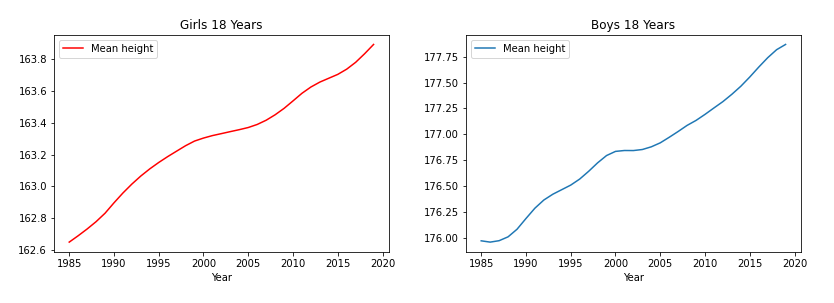
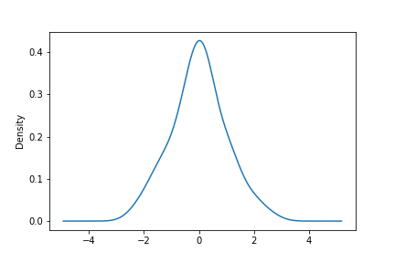
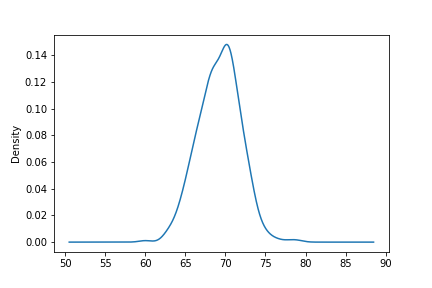
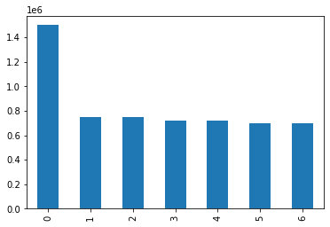
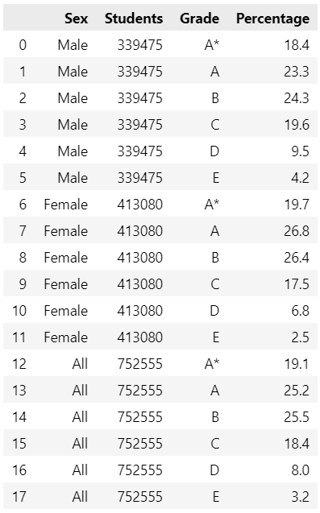
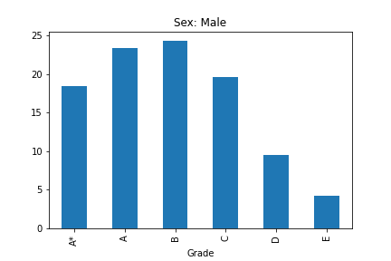
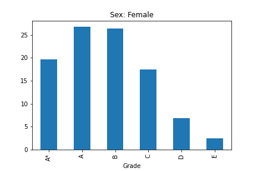
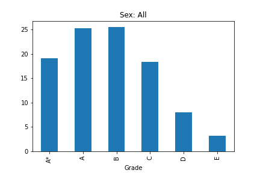

## Statistics 101

# Mean, Median and Mode: What Are they and When Should You Use Them

## You probably remember Mean, Median and Mode from high school stats classes but they are often used badly. We look at how you *should* use them with Python Pandas examples.

---*Splash image here*---

What is the average height of an 18-year-old British male? Or the
average price of a house in Madrid? Or the average grade achieved by
high school students in England?

These are all perfectly worded questions but mean something slightly
different in each case. The average in the first case is calculated
using the *mean*, the house prices would be better represented using the
*median* and the school grades by the *mode*.

We are going to try and unravel which measurement to use and when.

## Averages

The average is a measurement of a central tendency and typically we
would expect that it would be calculated by adding a set of values
together and then dividing by the number of values.

This is the *mean* and this works perfectly well for a normally
distributed set of data like height. The *median* is the central value
meaning that there are an equal number of measurements either side of
this value. Whereas the *mode* is the most frequent value in a set.

### Mean

You can legitimately track the height of British 18-year olds over time
by adding all of their heights together and dividing by the number of 18 year-old Brits. (That\'s quite a task so you\'d probably want to take a representative sample instead - you'd also want to separate them in to two groups: males and females)

And if you tracked this over time you\'d get a graph like the one below.

*Source [Our World in Data](https://ourworldindata.org/grapher/average-height-by-year-of-birth?country=~OWID_WRL)*

This works fine because height follows a normal distribution.

In a normal distribution values are distributed evenly around a central
point and tail off similarly to the left and right as illustrated in the
graph below.

And if we look at the height of a set of individuals we can see that the
measurements follow, pretty much, the same pattern - a normal distribution. 

In the figure below we use the 
height data recorded by the influencial statistician Sir Francis Galton (1822-1911) in his famous experiment that illustrated the statistical concept, regression to the mean (he noted that the adult offspring of shorter people tended to be taller than their parents while those of taller mohters and fathers tended to be shorter than their parents).

We use the data here simply to explore the range in height of over 500 18 year-old male adults.

Galton\'s height data, source:Public data from [Harvard
Dataverse](https://dataverse.harvard.edu/)

As you can see the graph very closely resembles a normal distribution and that the central tendency is around 70 inches. We measure that tendency by calculating the mean.

### Median

In case of a normal distribution the mean and the median are the same
value but that is not true for other types of distribution.

Take the house price example. In most major cities around the World
there are a wide range of properties and prices but there are a relatively small number of very expensive properties. These expensive properties skew the mean. 

So, for example, instead of measuring the average price of an apartment in Madrid a more meaningful measurement would be the price of an average apartment. 

If you think they are the same thing, let's take a look at a simple ficticious example. Imagine an apartment block with different sized properties: mostly three bedroom apartments but at the top of the building a luxury penthouse that occupies the entire top floor of the building.

The apartment block is in a sought-after area in the centre of Madrid not far from the Retiro park. None of the apartments are going to be cheap.

Let's say there are 4 floors. Each of the lower floors house two 3 bed apartments which are priced at 700,000€ for the bottom floor, 720,000 the the next one up, 750,000 for the one above that and the top floor, as we said is the penthouse - a luxury apartment with 5 bedrooms - which costs 1.5 million euros.

If we were to take the arithmetic mean of the prices we would get an average of approximately 834285€. But nobody paid that price for an apartment, all but one are below that figure as only one person had to fork out 1.5 million.

So the mean is not a very useful figure even if it is the average price. A more reasonable measure of the average is the median, the value in the centre of the range which is 720000€, a much better representation of the price paid by most people. 

Here is a little code that illustrates the example:

    d = {'Price':[1500000,        # Penthouse
                750000,750000,    # Floor 3
                720000,720000,    # Floor 2
                700000,700000     # Floor 1
                ]}

    df = pd.DataFrame(d)
    df.plot.bar(legend=False)

    print(f"Mean {df['Price'].mean()}")
    print(f"Median {df['Price'].median()}")

That prints out the following:

_Mean 834285.7142857143_

_Median 720000.0_

And looking at the bar graph makes it clear that the mean price is not illustrative of the apartment prices.

So the while mean is the average house price, the median is the price of the average house which, in this example, is a more useful number.

### Mode

Mode is often used to find a central tendency for categorical data.

So let's look at the third of our questions, the average exam grades for British high school students. Here is a table of results for the 'A level' exams for 18-year-olds in 2021[1] (A levels are basically university entrance exams).

Grades are A*, A, B, C, D, and E and the results are broken up by sex and the percentages of each grade is given. So you can see that 18.4% of males gained an A* grade, 19.7% of females got the same grade and overall the percentage of all student gaining an A* was 19.1.

Obviously we cannot find an average by calculatindg a mean as the data is not numerical but we can clearly see which was the most popular grade. Here are some bar charts that illustrate this:

And from this we can see that more males achieved a B grade than any other, but for females it was an A grade.

And this most popular grade is the _mode_ and is a clear way of showing the average grade.

1. This data is a subset of that provided by Ofqual https://analytics.ofqual.gov.uk/apps/Alevel/Outcomes/ and is used in accordance with the Open Government Licence v3.0

