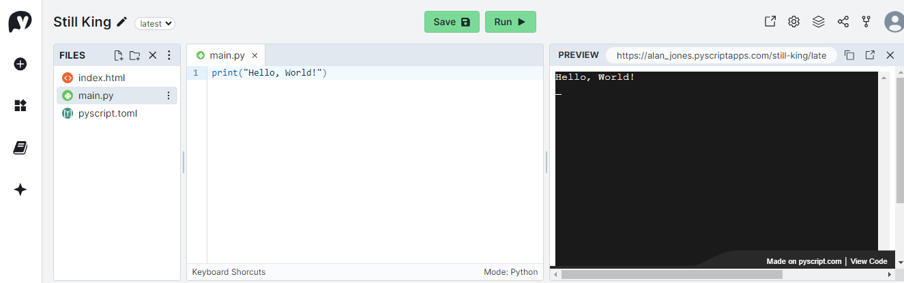
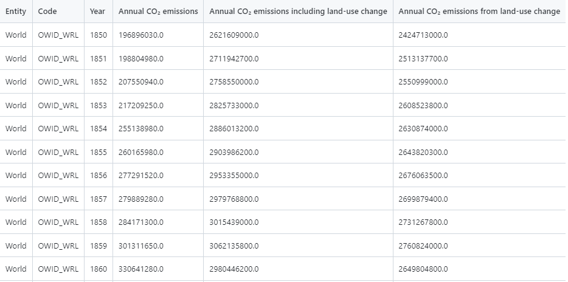

# PyScript is Growing Up

## We build a data viz app with the new faster PyScript

According to pyscript.org:

> If the web and Python had a baby, you'd get PyScript.

While I'm not sure that is a concept that I want to engage with, I get the point. PyScript combines two of the most important global technologies, the web and Python. Only time will tell how important it turns out to be but, if nothing else, it's a pretty cool technology.

PyScript was built on top of the Pyodide Python interpreter which is a port of CPython to WASM the web assembly language that can run in a browser. This means that you can execute Python programs, natively, in the browser - no translating to Javascript is required.

Does this signal the end of JavaScript? 

No, it doesn't. PyScript sits alongside JavaScript and communicates with it; JavaScript remains an essential part of the browser ecosystem.

### PyScript Next

PyScript has been around for barely a couple of years but it has already undergone a major re-write. In the new version, you have a choice of interpreters: the original Pyodide interpreter and now a MicroPython interpreter, too. 

One of the drawbacks of PyScript has been the fairly lengthy load time but now, according to [Jeff Glass](https://jeff.glass/), the blogger and a maintainer of PyScript, the new version using Pyodide loads significantly quicker than the original and, when using the much smaller footprint MicroPython, loads in only 4% of the time.

Small also means less capable, though. MicroPython was designed to run on micro-controllers and does not include the full set of standard libraries, let alone access to the vast number of packages available on PyPi. Pyodide, on the other hand, has several packages built in and can load pure Python packages from PyPi.

### Can we have some code, please

Yes, of course, I was just getting around to it.

First, we're going to write a bare-bones PyScript app just to get a pattern in our heads of how a PyScript app is constructed (it's quite simple). Then we'll develop a data visualisation app that imports external data and uses Python libraries to produce an engaging web page that can be deployed on any server.

There are a few options when constructing a PyScript app but we are going to use the recommended method which requires the use of three files: an HTML file, a configuration file and a file that contains the Python scripts.

_And here is a warning: the new version of PyScript is not completely compatible with the previous versions. So, if you've followed any of my previous tutorials about PyScript, please pretend that you didn't. I'm not going to detail the differences; we'll just build an app with the new version - you'll see that it is not so very different._

The easiest way to get started is to sign up for an account on _pyscript.com_. This is an online IDE that lets you code run and publish PyScript apps for free.

If you do that and click on the little plus sign on the left of the dashboard, it will set up a new project for you with three default files.

The files are _index.html_, _main.py_ and _pyscript.toml_. (If you want to run through this on your local machine, rather than _pyscript.com_ then you can copy the files from the listings below - put them all in the same folder)

These are the three files that I mentioned earlier and we'll go through them one by one.

### _index.html_

Yes, I'm sorry, but you do have to know a bit of HTML. It's not so difficult, though. Here's the file that will be generated by _pyscript.com_:

```html
<!DOCTYPE html>
<html lang="en">
<head>
    <title>Still King</title>

    <!-- Recommended meta tags -->
    <meta charset="UTF-8">
    <meta name="viewport" content="width=device-width,initial-scale=1.0">

    <!-- PyScript CSS -->
    <link rel="stylesheet" href="https://pyscript.net/releases/2024.3.1/core.css">

    <!-- This script tag bootstraps PyScript -->
    <script type="module" src="https://pyscript.net/releases/2024.3.1/core.js"></script>
</head>
<body>
    <script type="py" src="./main.py" config="./pyscript.toml" terminal></script>
</body>
</html>
```

This is a pretty basic web page: `<!DOCTYPE html>` tells the browser that this is an HTML5 file; the rest of the file is contained in a pair of `<html>`tags and the language is set to be English;  within those tags are a pair of `<head>`tags and a pair of `<body>`tags.

Inside the _head_ there are recommended meta tags that will ensure that the file is correctly rendered on a range of devices. Following that we import the PyScript CSS file and the PyScript JavaScript file from _pyscript.net_. Note that the particular releases of the files are specified (here it is version 2024.3.1) - in previous versions you were able to specify the 'latest' version but this is now deprecated. Loading the latest version was always a dodgy idea, I think, because any changes to a new version could potentially break your app.

In the _body_ tag is a `<script>` tag that  has the following attributes:

- `type="py"` - this means that the Pyodide interpreter will be used. For Micropython the type needs to be "mpy".

- `src="./main.py"`- this is the location and name of the Python script.

- `config="./pyscript.toml"` - this is the configuration file that can be either in TOML or JSON format - here we are using TOML.

- `terminal`- this tells PyScript that there should be a terminal window on the web page (it's here that the perennial phrase "Hello World" will be written).

### _pyscript.toml_

The purpose of this file is to set the configuration for the app. It is here that external files and libraries should be declared. In this app there is no configuration to speak of and it only contains the name of the app:

```toml
name = "Still King"
```

### _main.py_

Here is where the Python code resides and later we will see a rather more complex chunk of code. But for now _main.py_ simply contains:

```python
print("Hello, World!")
```

Now, that was a surprise, wasn't it?

The `print`statement is standard Python and its output is to the terminal (which is on the web page). So, when you load the page you will simply get a message written into a black panel on an otherwise blank webpage.

### Running the app

If you are using _pyscript.com_, then simply hit the _run_ button and the webpage will be rendered in a _preview_ panel.

 

If you are working locally, then you need to start up a local web server ( just double-clicking on the web page will not load the other files due to CORS restrictions). So, open a command window, navigate to your working directory and type:

```bash
python -m http.server
```

This will start a server so, in your browser, open "localhost:8000". This should automatically open "index.html" and thus run the app. If for some reason this doesn't happen (maybe you called your file something else), you should see a directory listing of your folder - click on the HTML file to run it.

You can find the app on _pyscript.com_ here: [Still King](https://alan_jones.pyscriptapps.com/still-king/latest/) - click in the bottom right of the screen to see the code. (You've probably guessed that _pyscript.com_ chooses the name of the application - you can, of course, change it.)

### The Data Viz App

OK, one step at a time. Before we can visualise it, we need some data. I'm going to use a dataset that tracks Global CO2 emissions over time - you can download it here [CO2 Data](https://raw.githubusercontent.com/alanjones2/CO2/master/data/world_df.csv) (also see _Notes_, below). Put it into the same folder as the code. You can see what it looks like in the image below.



It is a subset of a larger dataset that includes many countries and areas of the World. This file contains data for the World as a whole, so the first two columns are somewhat redundant. To find out more about the data see the Notes, below.

PyScript cannot access the local file system but it maintains a virtual file system that resides in the browser (well, to be accurate it is Pyodide that does this). So, in order to have access to the data we need PyScript to copy the file into the virtual files system when it loads the page.

To achieve this, we need an addition to the _pyscript.conf_ file. Add the following code to that file.

```toml
[files]
"world_df.csv" = "./world_df.csv"
```

This files section tells PyScript to copy the file "world_df.csv" into a file of the same name in the virtual file system when the page loads. Now, when the app has started the CSV file can be accessed by Python code in the conventional way. For example, we will load the data into a Pandas dataframe like this:

```python
df = pd.read_csv('./world_df.csv')
```

We are going to use Plotly to draw a chart on our web page. As you doubtless know, we can define Plotly charts in Python but when it icmes to displaying them on a web page


### Notes

- [CO2 Data](https://raw.githubusercontent.com/alanjones2/CO2/master/data/world_df.csv) can be downloaded from my GitHub repo using the link, it is derived from the [Our World in Data (OWID) co2-data GitHub repository](https://github.com/owid/co2-data), [Creative Commons BY license](https://creativecommons.org/licenses/by/4.0/)

- ____Github, pyscript.com urls here___

- All images, screenshots, etc. are by me, the author, unless otherwise indicated.

- _Disclaimer: I have no affiliation with Anaconda, PyScript.com_or PyScript.net._
