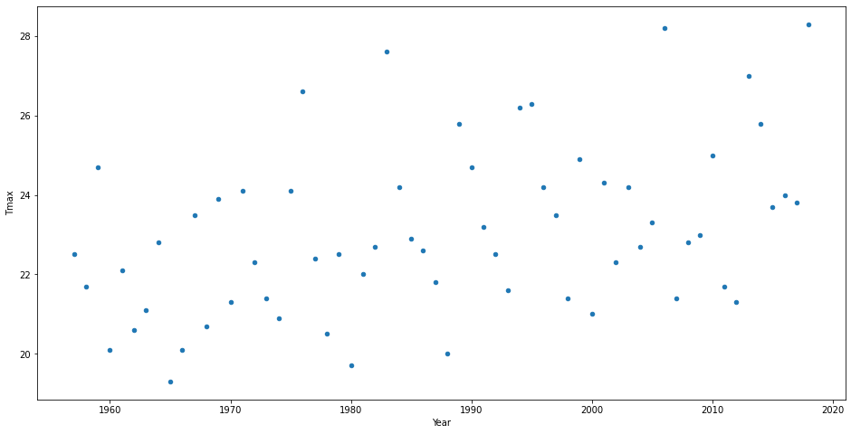
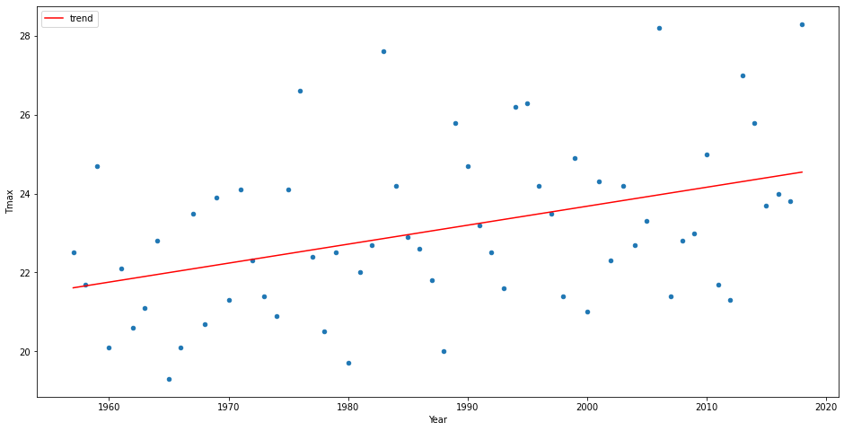
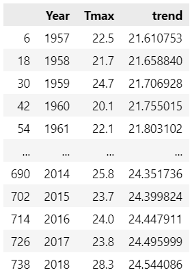
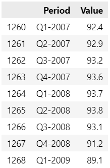
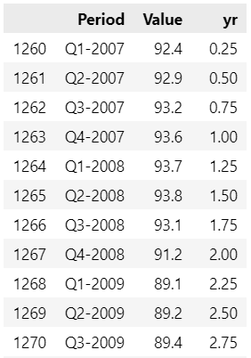
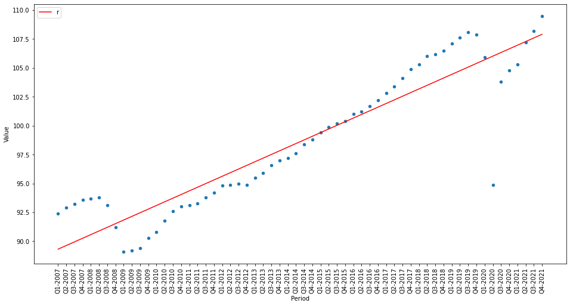
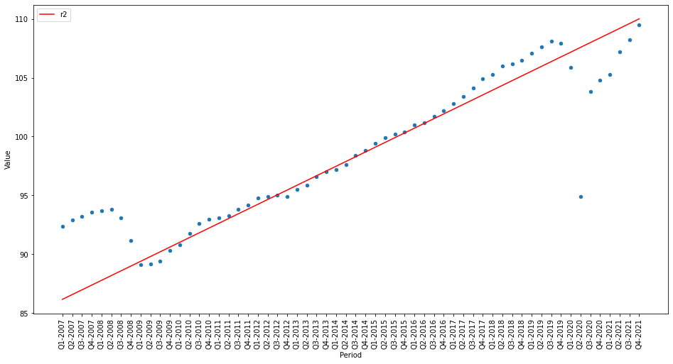

# Adding Regression Lines to Pandas Plots with SciPy

## Regression can be used to predict the future or to identify trends and relationships in data

### Finding a trend

import libraries

        import pandas as pd
        from scipy import stats

download weather data
create a df that contains the Tmax from 1957 to 2018 and draw a scatter plot
can't see any trend

        weather = pd.read_csv('https://raw.githubusercontent.com/alanjones2/dataviz/master/londonweather.csv')
        july = weather.query('Month == 7')[['Year','Tmax']]
        july.plot.scatter(y='Tmax',x='Year', figsize = (16,8))

try to fit a regression line
build a model and create a trend line
plot the trend line on top of the scatter plot

        x = july['Year']
        y = july['Tmax']

        m = stats.linregress(x, y)

        t = [m.slope * i + m.intercept for i in x]

        july.insert(len(july.columns),'trend',t)

        ax = july.plot.scatter(x='Year',y='Tmax')
        july.plot.line(x='Year',y='trend', color='red', ax=ax, figsize = (16,8))

now can clearly see an upwards trend 

### Predicting values

get oecd data and filter it to get gpd volume data fro the G7

        gdpdata = pd.read_csv('https://github.com/alanjones2/stGDPG7/raw/main/QNA_26022022111050612.csv')
        G7data = gdpdata[(gdpdata['MEASURE']=='VIXOBSA') 
                & (gdpdata['Country']=='G7')]
        
        G7data=G7data[['Period','Value']]

goes from Q1-2007 Q4-2021 to looks like

add a year column: easier to use than q1-2007

        def formyr(x,data):
            d = data['Period'].values[x]
            y= int(d[-4:])+int(d[1:2])*0.25 - 2007
            return y   

        yr=[formyr(x,G7data) for x in range(len(G7data)) ]
        G7data['yr'] = yr

now looks like

now make the model and overlay on the scatter diagram

        x = G7data['yr']
        y = G7data['Value']

        m = stats.linregress(x, y)

        t = [m.slope * i + m.intercept for i in x]
        G7data.insert(len(G7data.columns),'r',t)

        ax = G7data.plot.scatter(x='Period',
                                y='Value')
        G7data.plot.line(x='Period',
                        y='r', 
                        color='red', 
                        ax=ax, 
                        figsize = (16,8), 
                        rot=90)

trendline is not very good as a predictor because of the major events of 2008 and 2020
try a model over the intervening years year 2 to year -8

        G7data2009 = G7data[(G7data['yr']>2) & (G7data['yr']<=8)]

        x = G7data2009['yr']
        y = G7data2009['Value']

        m = stats.linregress(x, y)

        t = [m.slope * i + m.intercept for i in G7data['yr']]

        G7data.insert(len(G7data.columns),'r2',t)

        ax = G7data.plot.scatter(x='Period',
                                y='Value')
        ax = G7data.plot.line(x='Period',
                        y='r2', 
                        color='red', 
                        ax=ax, 
                        figsize = (16,8), 
                        rot=90)

trained on intervening years, the model does a pretty good job of predicting up Q1 2021 

2 things:
    - the model is useful for predicting under normal circumstances
    - but random events happen in real life that cannot be predictded